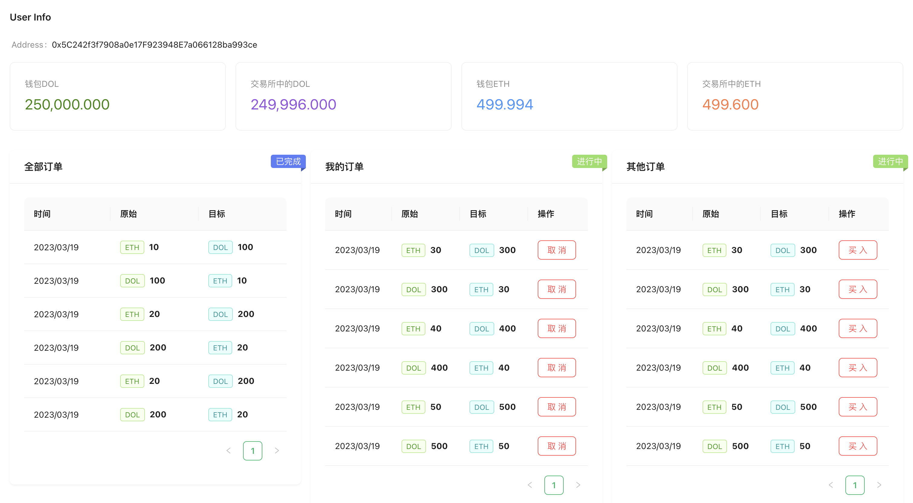

# Web3 Demo

使用方式：

一、clone项目到本地

```shell
git clone https://github.com/lxs2048/web3.git
```

二、安装依赖

```shell
npm i
```

三、创建本地区块链环境

```shell
npm i ganache -g
```

启动：`ganache`命令，生成了10个账号

四、复制私钥在MetaMask插件导入账号

五、编译并部署

```shell
truffle migrate --reset
```

六、启动项目

```
npm start
```

七、执行测试脚本生成订单

```
truffle exec ./scripts/createOrders.js
```

启动后执行的原因是项目监听生成订单自动更新页面

效果图如下



参考教程：https://www.bilibili.com/video/BV1Fd4y1x7jR

本项目在学习过程中有挺多改动，如交易所和一些测试文件提取了一些通用方法，前端的redux使用进行了封装优化
